# Steam Cloud File Manager

**English** | [简体中文](README.md)

<p align="center">
  
</p>

<p align="center">
  <a href="https://www.rust-lang.org"></a>
  <a href="https://deps.rs/repo/github/Fldicoahkiin/SteamCloudFileManager"></a>
  <a href="https://github.com/Fldicoahkiin/SteamCloudFileManager/stargazers"></a>
  <a href="https://github.com/Fldicoahkiin/SteamCloudFileManager/network/members"></a>
</p>

<p align="center">
  <a href="https://www.gnu.org/licenses/gpl-3.0"></a>
  <a href="https://github.com/Fldicoahkiin/SteamCloudFileManager/releases"></a>
  <a href="https://github.com/Fldicoahkiin/SteamCloudFileManager/releases"></a>
  <a href="https://github.com/Fldicoahkiin/SteamCloudFileManager/actions/workflows/build.yml"></a>
  <a href="https://github.com/Fldicoahkiin/SteamCloudFileManager/actions/workflows/release.yml"></a>
  <a href="https://qm.qq.com/q/rljNzv4OaS"></a>
</p>

<p align="center">
  <a href="https://github.com/Fldicoahkiin/homebrew-tap"></a>
  <a href="https://aur.archlinux.org/packages/steam-cloud-file-manager-bin"></a>
  
  
  
  
  
  
  
</p>

> Cross-platform Steam Cloud file management utility built with Rust and egui.

## Features

A cloud save management utility built with Rust and the Steamworks SDK. By directly interfacing with low-level Steam APIs, it provides complete visibility and control over your cloud files. It supports uploading, downloading, and deleting individual files, and introduces a symlink sync solution to resolve cross-platform configuration sync issues.

- **VDF File Tree Visualization**: Fully parses `remotecache.vdf` to reconstruct the cloud directory structure.
- **Batch Transfer**: Supports multi-file selection and drag-and-drop for uploads/downloads.
- **Deep Control**: Directly delete cloud files and force sync status updates.
- **Root Path Mapping**: Parses numeric Root IDs (0-12) from `remotecache.vdf` and automatically resolves them to absolute local disk paths (this mapping is undocumented in official sources).
- **Search & Filter**: Supports regex search for filenames, paths, and sync status.
- **Game Library Scanning**: Automatically discovers local games by parsing `libraryfolders.vdf`.
- **Symlink Sync**: Supports mounting locally unsupported files to Steam Cloud via symlinks (Experimental).
- **UFS Config Management**: Directly read/write `appinfo.vdf` to edit Auto-Cloud configuration like the Steamworks backend (Experimental). Add/edit/delete savefiles rules and rootoverrides path mappings to customize cloud sync behavior.
- **Multi-Platform Support**: Windows / macOS / Linux.

## Platform Compatibility

Supports **Windows (x64)**, **macOS (Intel & Apple Silicon)**, and **Linux (x64)**.
Build artifacts include standard installers and portable versions (Generic Binary / AppImage).

> _Note: Due to upstream Steamworks SDK limitations, we cannot currently build ARM64 versions for Windows and Linux._

## Installation

### Windows

1. Download [](https://github.com/Fldicoahkiin/SteamCloudFileManager/releases)
2. Extract to any location
3. Double-click `SteamCloudFileManager.exe` to run

> **Note**:
>
> - Windows: Logs are saved in the `logs/` folder in the application directory.
> - macOS: Logs are saved in `~/Library/Logs/SteamCloudFileManager/` directory.
> - Linux: Logs are saved in `~/.local/share/SteamCloudFileManager/logs/` directory.

### macOS

#### Homebrew

**Install (Recommended, auto-installs to Applications):**

```bash
brew tap Fldicoahkiin/tap
brew install --cask steam-cloud-file-manager
```

> If the app is reported as damaged, run: `xattr -cr "/Applications/Steam Cloud File Manager.app"`

**Install as Formula (Terminal launch command only):**

```bash
brew install steam-cloud-file-manager
```

#### Manual Installation

1. Download the version for your architecture:
   - Intel: [](https://github.com/Fldicoahkiin/SteamCloudFileManager/releases)
   - Apple Silicon: [](https://github.com/Fldicoahkiin/SteamCloudFileManager/releases)
2. Open the DMG file
3. Drag the app to the Applications folder
4. If you encounter a "Damaged" or "Cannot be opened" error, run the following command in Terminal to fix the signature:

   ```bash
   xattr -c "/Applications/Steam Cloud File Manager.app"
   ```

### Arch Linux (AUR)

```bash
yay -S steam-cloud-file-manager-bin
# or
paru -S steam-cloud-file-manager-bin
```

Manual build:

```bash
git clone https://aur.archlinux.org/steam-cloud-file-manager-bin.git
cd steam-cloud-file-manager-bin
makepkg -si
steam-cloud-file-manager
```

Or download [](https://github.com/Fldicoahkiin/SteamCloudFileManager/releases) pre-built package:

```bash
tar -xzf SteamCloudFileManager-*-linux-x86_64-aur.tar.gz
cd SteamCloudFileManager-*-linux-x86_64-aur
makepkg -si
steam-cloud-file-manager
```

### Debian/Ubuntu

Download [](https://github.com/Fldicoahkiin/SteamCloudFileManager/releases)

```bash
sudo dpkg -i steam-cloud-file-manager_*.deb
sudo apt-get install -f
steam-cloud-file-manager
```

### Fedora/RHEL/openSUSE

Download [](https://github.com/Fldicoahkiin/SteamCloudFileManager/releases)

```bash
sudo dnf install ./steam-cloud-file-manager-*.rpm
steam-cloud-file-manager
```

### AppImage (Universal)

Download [](https://github.com/Fldicoahkiin/SteamCloudFileManager/releases)

```bash
chmod +x SteamCloudFileManager-*.AppImage
./SteamCloudFileManager-*.AppImage
```

### .tar.gz (Universal)

Download [](https://github.com/Fldicoahkiin/SteamCloudFileManager/releases)

```bash
tar -xzf SteamCloudFileManager-*-linux-x86_64.tar.gz
./steam-cloud-file-manager
```

### Build from Source

```bash
git clone https://github.com/Fldicoahkiin/SteamCloudFileManager.git
cd SteamCloudFileManager
cargo build --release
```

**Build Dependencies:**

- **Cargo**
- **Rust 1.90.0+**
  - Uses Rust 2021 edition
  - Install: `curl --proto '=https' --tlsv1.2 -sSf https://sh.rustup.rs | sh`

- **C++ Toolchain:**
  - **Windows**:
    - Visual Studio 2019 or newer (recommend installing "Desktop development with C++" workload)
    - Or [Build Tools for Visual Studio](https://visualstudio.microsoft.com/downloads/#build-tools-for-visual-studio-2022)
  - **macOS**:
    - Xcode Command Line Tools: `xcode-select --install`
  - **Linux**:
    - gcc/g++ or clang
    - Ubuntu/Debian: `sudo apt install build-essential`
    - Fedora: `sudo dnf install gcc gcc-c++`
    - Arch: `sudo pacman -S base-devel`

**Runtime Dependencies:**

- Steam client (must run in debug mode)

## Usage

### Steam Debug Mode

This tool uses the CDP protocol to communicate with Steam, so you **must** launch Steam with debugging enabled.

**Why is this required?**

- CDP (Chrome DevTools Protocol) is the debugging interface for Steam's built-in browser.
- We use this interface to fetch the cloud file list and download links.
- The CDP port is only active when debug mode is enabled.

**Windows:**

1. Right-click your Steam shortcut and select "Properties".
2. Add `-cef-enable-debugging` to the end of the "Target" field.
3. Click "OK" and launch Steam.

**macOS:**

1. Quit Steam.
2. Run in Terminal:

   ```bash
   open -a Steam --args -cef-enable-debugging
   ```

**Linux:**

1. Close Steam.
2. Run in Terminal:

   ```bash
   steam -cef-enable-debugging &
   ```

   Or edit your Steam shortcut and append `-cef-enable-debugging` to the Exec line.

**Note:** The software features a built-in "Restart Steam in Debug Mode" button that automates this process.

### Basic Workflow

1. Ensure Steam is running in debug mode.
2. Select the target game:
   - **Game Library**: Click the game library button to select a local game (auto-connects).
   - **Manual Input**: Enter App ID and click **"Connect"**.
3. Once loaded, manipulate files via the tree view on the left.

App IDs can be found in Steam Store URLs or on [SteamDB](https://steamdb.info/).

> ⚠️ **Warning**
>
> - **Irreversible Action**: Deletions are committed to the local cache immediately.
> - **Data Safety**: We recommend backing up original files before batch operations.
> - **Sync Mechanism**: Changes are written to the local cache and uploaded asynchronously by Steam. Do not kill the Steam process before sync completes.

### Cloud Sync Mechanism

```mermaid
graph TB
    subgraph dev["🔧 Developer"]
        Steamworks["Steamworks Backend<br/>Configure ufs"]
        GameCode["Game Code"]
    end
    
    Cloud(("🌐 Steam Server"))
    
    subgraph client["🖥️ Steam Client"]
        subgraph vdf["Local VDF Files"]
            AppInfo[(appinfo.vdf)]
            RemoteCache[(remotecache.vdf)]
        end
        
        subgraph sync["☁️ Steam Cloud Sync"]
            Auto["Steam Auto-Cloud<br/>Auto recursive file matching"]
            API["Steam Cloud API<br/>ISteamRemoteStorage"]
        end
    end
    
    %% Steamworks config delivery
    Steamworks --> Cloud
    Cloud -->|Deliver ufs Config| AppInfo
    AppInfo -->|ufs Config Rules| Auto
    Auto --> RemoteCache
    
    %% Game code calls API
    GameCode -->|Call API| API
    API -->|Write File| RemoteCache
    
    %% Bidirectional sync
    RemoteCache <===>|Bidirectional Sync| Cloud
```



**This Tool's Interaction Flow:**

```mermaid
graph TB
    Tool["🛠️ This Tool"]
    
    subgraph client["🖥️ Steam Client"]
        subgraph vdf["Local VDF Files"]
            AppInfo[(appinfo.vdf)]
            RemoteCache[(remotecache.vdf)]
        end
        
        subgraph sync["☁️ Steam Cloud Sync"]
            Auto["Steam Auto-Cloud"]
            API["Steam Cloud API"]
        end
        
        Browser["🌐 Steam Built-in Browser<br/>127.0.0.1:8080"]
    end
    
    Cloud(("🌐 Steam Server"))
    
    %% This tool's operations (inject into flow)
    Tool -.->|Read| AppInfo
    Tool -.->|Read| RemoteCache
    Tool ==>|Inject ufs Config| AppInfo
    Tool -->|Call API| API
    Tool -->|CDP Get Download Link| Browser
    
    %% Steam internal flow
    AppInfo -->|ufs Config Rules| Auto
    Auto --> RemoteCache
    API -->|Write File| RemoteCache
    RemoteCache <===>|Bidirectional Sync| Cloud
    Browser <-->|Access Cloud Storage| Cloud
```



<details>
<summary><b>Full Architecture Diagram (Click to Expand)</b></summary>



</details>

```mermaid
graph LR
    subgraph left["External"]
        subgraph dev["🔧 Developer"]
            Steamworks["Steamworks Backend<br/>Configure ufs"]
            GameCode["Game Code"]
        end
        Tool["🛠️ This Tool"]
    end
    
    subgraph client["🖥️ Steam Client"]
        subgraph vdf["Local VDF Files"]
            AppInfo[(appinfo.vdf)]
            RemoteCache[(remotecache.vdf)]
        end
        
        subgraph sync["☁️ Steam Cloud Sync"]
            Auto["Auto-Cloud"]
            API["Steam Cloud API"]
        end
        
        Browser["🌐 Built-in Browser"]
    end
    
    Cloud(("🌐 Steam<br/>Server"))
    
    %% Developer flow
    Steamworks --> Cloud
    Cloud -->|Deliver ufs Config| AppInfo
    GameCode -->|Call API| API
    
    %% Steam internal flow
    AppInfo --> Auto
    Auto --> RemoteCache
    API --> RemoteCache
    RemoteCache <===> Cloud
    Browser <--> Cloud
    
    %% This tool's operations
    Tool -.->|Read| AppInfo
    Tool -.->|Read| RemoteCache
    Tool ==>|Inject ufs| AppInfo
    Tool -->|Call| API
    Tool -->|CDP| Browser
```

#### Two Types of Steam Cloud Sync

Steam provides two cloud sync mechanisms:

**Auto-Cloud**\
Developers configure in Steamworks backend, Steam automatically scans specified directories:

- Steam actively scans configured directories
- Automatically matches files based on patterns (e.g., `*.sav`)
- New files are automatically added to remotecache.vdf and synced
- Configuration stored in appinfo.vdf's `ufs` section

**Steam Cloud API**\
Game code calls `ISteamRemoteStorage::FileWrite()` to explicitly register files:

- Steam does not actively scan
- Requires game to call API to register files
- User-created files are not automatically synced

**This Tool's Positioning**:\
This tool provides two ways to control cloud sync:

1. **Steam Cloud API**: Manually call API to register files, solving the problem of games not writing to symlinked directories
2. **UFS Config Injection** (New Feature): Directly modify local `appinfo.vdf`'s `ufs` section, enabling Steamworks-like configuration management. You can:
   - Add/edit/delete `savefiles` rules (specify sync directories, file patterns, and recursive search option)
   - Add/edit/delete `rootoverrides` path mappings (cross-platform path conversion)
   - Configure `pathtransforms` path transformation rules (optional, for dynamic path substitution)
   - Customize cloud sync paths for any game

> ⚠️ **Note**: UFS config injection modifies local appinfo.vdf. Steam updates may overwrite these changes. Backup your configuration before modifying.

### Data Flow


### Data Source Priority

| Source        | Data Content                             | Priority   | Description                     |
| ------------- | ---------------------------------------- | ---------- | ------------------------------- |
| **VDF**       | Local cached file list, sync status      | Primary    | Parses `remotecache.vdf`        |
| **CDP**       | Real-time cloud file list, download URLs | Supplement | Via Steam's built-in browser    |
| **Steam API** | File read/write/delete, quota query      | Operations | `ISteamRemoteStorage` interface |

### Sync Status (`is_persisted`)

```
Newly uploaded file
  is_persisted = false  ← Only in local cache
  ↓
  Steam background upload (takes seconds to minutes)
  ↓
  is_persisted = true   ← Synced to cloud
```

> ⚠️ **Important**: `sync_cloud_files()` returns immediately; actual upload happens asynchronously in background. Steam forces sync completion on disconnect.

### CDP Protocol

Fetches real-time cloud data via Steam's CEF (Chromium Embedded Framework) debug interface:

1. **Detect**: Access `http://127.0.0.1:8080/json` to get debug target list
2. **Connect**: Establish WebSocket connection to target page
3. **Navigate**: Go to `store.steampowered.com/account/remotestorage`
4. **Inject**: Execute JavaScript to extract file list and download URLs
5. **Merge**: Combine CDP data with VDF data, supplementing download URLs and real-time status

### VDF Parsing & Root Mapping

The tool parses `remotecache.vdf` in real-time for file lists, and parses **`appinfo.vdf`** to extract game cloud rules (`ufs` section), automatically handling Steam's Root ID mapping:

**What is Root ID?**

Steam uses numeric Root IDs (0-12) in `remotecache.vdf` to identify file storage locations. **This numeric ID to path mapping is not documented in any official sources** - it has been verified through VDF file parsing and actual game testing.

| Root ID | Steamworks Root Name    | Windows Path Example              |
| ------- | ----------------------- | --------------------------------- |
| 0       | `Default`               | `userdata/{uid}/{appid}/remote/`  |
| 1       | `App Install Directory` | `steamapps/common/GameName/`      |
| 2       | `WinMyDocuments`        | `%USERPROFILE%\Documents\`        |
| 3       | `WinAppDataLocal`       | `%LOCALAPPDATA%\`                 |
| 9       | `WinSavedGames`         | `%USERPROFILE%\Saved Games\`      |
| 11      | `SteamCloudDocuments`   | `Documents\Steam Cloud\`          |
| 12      | `WinAppDataLocalLow`    | `%USERPROFILE%\AppData\LocalLow\` |

**Details**:

- Developers use **string names** in Steamworks backend configuration (e.g., `WinMyDocuments`)
- Steam client stores as **numeric IDs** in `remotecache.vdf` (e.g., `2`)
- Official docs only publish string names; **numeric IDs are obtained by parsing remotecache.vdf**

- **[Root Path Mapping Table](ROOT_PATH_MAPPING.md)** - Complete validation data and cross-platform mappings

> **Note**: The Root path mapping table is verified through actual game testing. Contributions of new validation data are welcome!

## TODO

### Feature Development

- [x] Multi-language support (i18n) - Chinese/English
- [x] Version update detection
- [x] Tree view
- [x] Batch upload/download
- [x] File conflict detection and handling
- [x] Cloud save backup
- [x] Symlink sync support (experimental)
- [x] UFS config management (experimental) - Steamworks-like Auto-Cloud configuration editing
- [ ] Automatic backup schedule
- [ ] Launch on startup (system tray background service)
- [ ] Auto-inject UFS config on startup (auto-detect local save paths without manual operation)
- [ ] UFS config management page (dedicated visual interface, replacing current popup editor)
- [ ] Cloud save version history (view and rollback to previous versions)

### Package Manager Support

- [x] AUR (Arch User Repository) - `yay -S steam-cloud-file-manager-bin`
- [x] Homebrew (macOS) - `brew tap Fldicoahkiin/tap && brew install steam-cloud-file-manager`
- [ ] Winget (Windows) - `winget install steam-cloud-file-manager`
- [ ] Scoop (Windows) - `scoop install steam-cloud-file-manager`
- [ ] Chocolatey (Windows) - `choco install steam-cloud-file-manager`
- [ ] APT Repository (Debian/Ubuntu) - `apt install steam-cloud-file-manager`
- [ ] DNF/YUM Repository (Fedora/RHEL) - `dnf install steam-cloud-file-manager`
- [ ] Flatpak - `flatpak install steam-cloud-file-manager`
- [ ] Snap - `snap install steam-cloud-file-manager`

## Contributing

Welcome to submit Issues and Pull Requests! See [CONTRIBUTING.md](CONTRIBUTING.md) for detailed guidelines.

### How to Contribute

- 🐛 **Report Bugs**: Use Issue templates to submit problems
- ✨ **Request Features**: Share your ideas and suggestions
- 📖 **Improve Documentation**: Help improve README and technical docs
- 🌐 **Contribute Translations**: Add new languages, see [i18n Contribution Guide](I18N_GUIDE.md)
- 🗺️ **Add Root Mappings**: Submit game remotecache.vdf validation data to help improve the [Root Path Mapping Table](ROOT_PATH_MAPPING.md)
- 🔧 **Submit Code**: Fix bugs or implement new features

Currently supported languages:

- 简体中文
- English

## Contributors

<a href="https://github.com/Fldicoahkiin/SteamCloudFileManager/graphs/contributors">
  
</a>

## Project Structure

```
src/
├── main.rs                 # Entry: initialize logger, start eframe
├── app.rs                  # Main app: state holder, UI render loop
├── app_state.rs            # State structure definitions
├── app_handlers.rs         # Business logic handlers
├── async_handlers.rs       # Async task management (channel holders)
│
├── steam_api.rs            # Steam API wrapper (CloudFile struct)
├── steam_worker.rs         # External process communication (JSON RPC)
├── steam_process.rs        # Steam process management (start/stop)
│
├── file_manager.rs         # File operations (upload/download/delete)
├── file_tree.rs            # File tree structure
├── downloader.rs           # Batch downloader
├── backup.rs               # Backup functionality
├── conflict.rs             # Conflict detection
├── symlink_manager.rs      # Symlink management
│
├── vdf_parser.rs           # VDF file parsing (appinfo.vdf, loginusers.vdf)
├── appinfo_writer.rs       # appinfo.vdf writing (UFS config injection)
├── path_resolver.rs        # Path resolution (savefiles config → actual paths)
├── cdp_client.rs           # CDP web parsing (fetch remote file list)
├── game_scanner.rs         # Game scanning (merge VDF + CDP)
├── user_manager.rs         # User management
│
├── config.rs               # Configuration management (settings persistence)
├── update.rs               # Auto update
├── logger.rs               # Logging system
├── i18n/                   # Internationalization
│   ├── mod.rs              # Language enum and dispatch
│   ├── en.rs               # English
│   └── zh.rs               # 简体中文 (Chinese Simplified)
├── icons.rs                # Icon system (Phosphor Icons)
├── version.rs              # Version info
│
└── ui/
    ├── mod.rs              # UI module exports
    ├── app_panels.rs       # Panel rendering (top/bottom/center, action buttons, status bar)
    ├── controls.rs         # Control rendering
    ├── file_list.rs        # File list (table/tree view)
    ├── windows.rs          # Windows (game selector, user selector)
    ├── settings.rs         # Settings window
    ├── theme.rs            # Theme system (dark/light mode)
    ├── upload_dialog.rs    # Upload dialog
    ├── backup_dialog.rs    # Backup dialog
    ├── conflict_dialog.rs  # Conflict dialog
    ├── guide_dialog.rs     # Guide dialog
    ├── appinfo_dialog.rs   # AppInfo dialog
    ├── symlink_dialog.rs   # Symlink dialog
    └── font_loader.rs      # Font loader
```

## License

This project is licensed under GPL-3.0 - see [LICENSE](LICENSE) file for details.

## Acknowledgments

### Core Dependencies

- [steamworks-rs](https://github.com/Thinkofname/steamworks-rs) - Rust bindings for Steamworks SDK
- [egui](https://github.com/emilk/egui) - Immediate mode GUI framework
- [eframe](https://github.com/emilk/egui/tree/master/crates/eframe) - Cross-platform framework for egui
- [keyvalues-parser](https://github.com/CosmicHorrorDev/vdf-rs) - VDF text format parser
- [tungstenite](https://github.com/snapview/tungstenite-rs) - WebSocket client (CDP communication)

### Utility Libraries

- [rfd](https://github.com/PolyMeilex/rfd) - Native file dialogs
- [ureq](https://github.com/algesten/ureq) - HTTP client
- [anyhow](https://github.com/dtolnay/anyhow) - Error handling
- [tracing](https://github.com/tokio-rs/tracing) - Logging/tracing
- [serde](https://github.com/serde-rs/serde) - Serialization framework
- [image](https://github.com/image-rs/image) - Image processing
- [self_update](https://github.com/jaemk/self_update) - Auto update
- [regex](https://github.com/rust-lang/regex) - Regular expressions
- [chrono](https://github.com/chronotope/chrono) - Date/time
- [walkdir](https://github.com/BurntSushi/walkdir) - Directory traversal
- [open](https://github.com/Byron/open-rs) - Open files/URLs
- [dirs](https://github.com/dirs-dev/dirs-rs) - System directories
- [uuid](https://github.com/uuid-rs/uuid) - UUID generation
- [sha1](https://github.com/RustCrypto/hashes) - Hash computation
- [byteorder](https://github.com/BurntSushi/byteorder) - Byte order handling

### UI Extensions

- [egui-phosphor](https://github.com/amPerl/egui-phosphor) - Phosphor icon library
- [egui_extras](https://github.com/emilk/egui/tree/master/crates/egui_extras) - egui extension components

### Packaging Tools

- [cargo-bundle](https://github.com/burtonageo/cargo-bundle) - macOS .app/.dmg packaging
- [cargo-deb](https://github.com/kornelski/cargo-deb) - Debian/Ubuntu .deb packaging
- [cargo-generate-rpm](https://github.com/cat-in-136/cargo-generate-rpm) - Fedora/RHEL .rpm packaging
- [cargo-appimage](https://github.com/StratusFearMe21/cargo-appimage) - Universal AppImage packaging
- [cargo-aur](https://github.com/fosskers/cargo-aur) - Arch Linux PKGBUILD generation

### Reference Projects

- [SteamCloudFileManagerLite](https://github.com/GMMan/SteamCloudFileManagerLite) - Lightweight C# implementation
- [Facepunch.Steamworks](https://github.com/Facepunch/Facepunch.Steamworks) - Steamworks C# wrapper
- [SteamTools (Watt Toolkit)](https://github.com/BeyondDimension/SteamTools) - Open source Steam toolkit
- [SteamDatabase/SteamAppInfo](https://github.com/SteamDatabase/SteamAppInfo) - appinfo.vdf binary format documentation
- [tormak9970/new-vdf-parser](https://lib.rs/crates/new-vdf-parser) - Rust binary VDF parser library
- [tralph3/Steam-Metadata-Editor](https://github.com/tralph3/Steam-Metadata-Editor) - Python Steam metadata editor

### Documentation

- [Steamworks SDK](https://partner.steamgames.com/doc/sdk/api) - Official SDK documentation
- [Steamworks Steam Cloud](https://partner.steamgames.com/doc/features/cloud) - Official Steam Cloud documentation
- [ISteamRemoteStorage API](https://partner.steamgames.com/doc/api/ISteamRemoteStorage) - Steam Cloud API reference
- [Steam Cloud Best Practices](https://partner.steamgames.com/doc/features/cloud#best_practices) - Official best practices
- [VDF Parser (Python)](https://github.com/ValvePython/vdf) - Python VDF parser library
- [Stack Exchange: Steam Cloud](https://gaming.stackexchange.com/questions/146644) - Root path community verification
- [Quick Guide to Steam Cloud Saves](https://www.gamedeveloper.com/game-platforms/quick-guide-to-steam-cloud-saves) - Developer cloud save guide
- [A Gentle Introduction to Steamworks](https://www.gamedeveloper.com/business/a-gentle-introduction-to-steamworks) - Steamworks integration tutorial
- [Elena Temple Dev Blog](https://www.grimtalin.com/2018/04/elena-temple-steam-cloud-saves.html) - Unity cloud save configuration example

## Star History

<a href="https://www.star-history.com/#Fldicoahkiin/SteamCloudFileManager&type=date&legend=top-left">
 <picture>
   <source media="(prefers-color-scheme: dark)" srcset="https://api.star-history.com/svg?repos=Fldicoahkiin/SteamCloudFileManager&type=date&theme=dark&legend=top-left" />
   <source media="(prefers-color-scheme: light)" srcset="https://api.star-history.com/svg?repos=Fldicoahkiin/SteamCloudFileManager&type=date&legend=top-left" />
   
 </picture>
</a>
