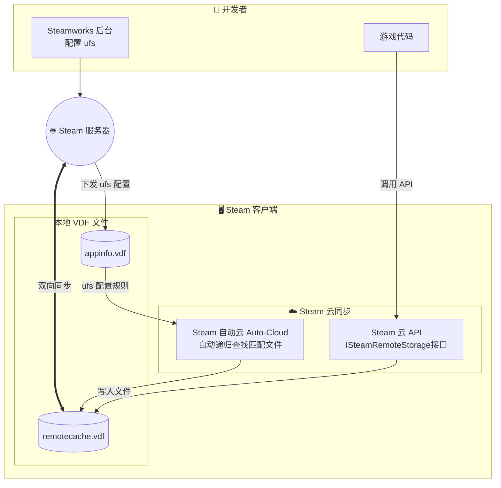
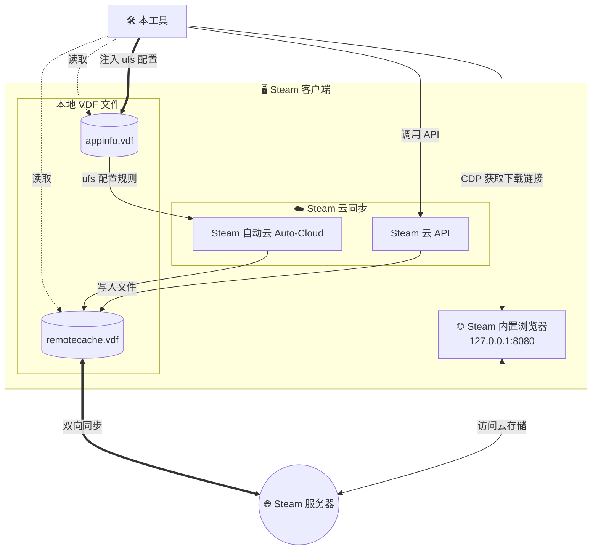
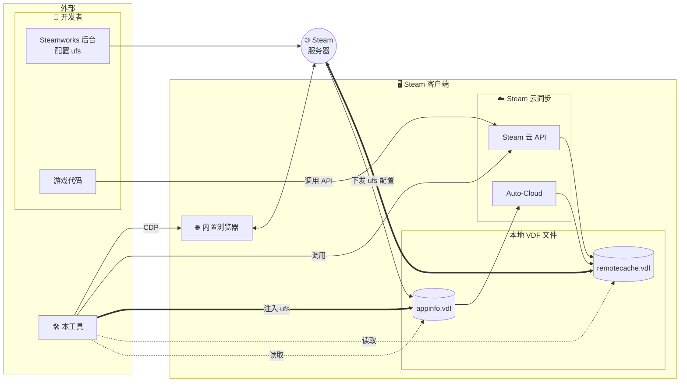
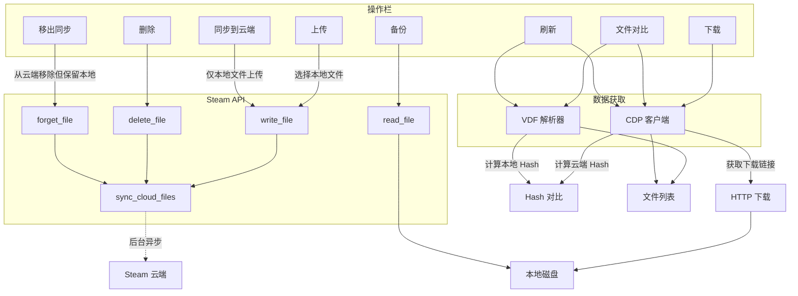

# Steam Cloud File Manager

[English](README.en.md) | **简体中文**

<p align="center">
  
</p>

<p align="center">
  <a href="https://www.rust-lang.org"></a>
  <a href="https://deps.rs/repo/github/Fldicoahkiin/SteamCloudFileManager"></a>
  <a href="https://github.com/Fldicoahkiin/SteamCloudFileManager/stargazers"></a>
  <a href="https://github.com/Fldicoahkiin/SteamCloudFileManager/network/members"></a>
</p>

<p align="center">
  <a href="https://www.gnu.org/licenses/gpl-3.0"></a>
  <a href="https://github.com/Fldicoahkiin/SteamCloudFileManager/releases"></a>
  <a href="https://github.com/Fldicoahkiin/SteamCloudFileManager/releases"></a>
  <a href="https://github.com/Fldicoahkiin/SteamCloudFileManager/actions/workflows/build.yml"></a>
  <a href="https://github.com/Fldicoahkiin/SteamCloudFileManager/actions/workflows/release.yml"></a>
  <a href="https://qm.qq.com/q/rljNzv4OaS"></a>
</p>

<p align="center">
  <a href="https://github.com/Fldicoahkiin/homebrew-tap"></a>
  <a href="https://aur.archlinux.org/packages/steam-cloud-file-manager-bin"></a>
  
  
  
  
  
  
  
</p>

> 基于 Rust 和 egui 构建的跨平台 Steam 云存档管理工具

## 功能

基于 Rust 与 Steamworks SDK 开发的云存档管理工具。通过直接调用 Steam 底层接口，实现了对云端文件的完全可视与控制。支持任意文件的上传、下载与删除，并提供软链接同步功能，有效解决了部分游戏配置文件无法跨平台同步的问题。

- **VDF 文件树可视化**：完整解析 `remotecache.vdf`，还原云端目录结构。
- **批量传输**：支持多文件选择与拖拽上传/下载。
- **深度控制**：直接删除云端文件，强制更新同步状态。
- **Root 路径映射**：解析 `remotecache.vdf` 中的数字 Root ID (0-12)，自动转换为本地磁盘绝对路径（该映射关系在官方文档中未公开）。
- **搜索与过滤**：支持文件名、路径及同步状态的正则表达式检索。
- **游戏库扫描**：通过解析 `libraryfolders.vdf` 自动发现本地游戏。
- **软链接同步**：支持将非原生支持的本地文件通过软链接挂载至 Steam Cloud（实验性）。
- **UFS 配置管理**：直接读写 `appinfo.vdf`，实现类 Steamworks 后台的 Auto-Cloud 配置编辑（实验性）。可添加/编辑/删除 savefiles 规则和 rootoverrides 路径映射，自定义游戏的云同步行为。
- **多平台支持**：Windows / macOS / Linux。

## 平台兼容性

支持 **Windows (x64)**、**macOS (Intel & Apple Silicon)** 以及 **Linux (x64)**。
构建产物包含常规的安装包及免安装版本（Generic Binary / AppImage）。

> _注：由于 Steamworks SDK 的上游限制，目前无法构建 Windows 和 Linux 的 ARM64 版本。_

## 安装

### Windows

1. 下载 [](https://github.com/Fldicoahkiin/SteamCloudFileManager/releases)
2. 解压到任意位置
3. 双击 `SteamCloudFileManager.exe` 运行

> **注意**：
>
> - Windows 版本日志保存在应用所在目录的 `logs/` 文件夹。
> - macOS 版本日志保存在 `~/Library/Logs/SteamCloudFileManager/` 目录。
> - Linux 版本日志保存在 `~/.local/share/SteamCloudFileManager/logs/` 目录。

### macOS

#### Homebrew

**安装（推荐，自动安装到应用程序）：**

```bash
brew tap Fldicoahkiin/tap
brew install --cask steam-cloud-file-manager
```

> 如果安装后提示应用损坏，请运行：`xattr -cr "/Applications/Steam Cloud File Manager.app"`

**作为 Formula 安装（仅提供终端启动命令）：**

```bash
brew install steam-cloud-file-manager
```

#### 手动安装

1. 下载对应版本：
   - Intel 芯片：[](https://github.com/Fldicoahkiin/SteamCloudFileManager/releases)
   - Apple Silicon：[](https://github.com/Fldicoahkiin/SteamCloudFileManager/releases)
2. 打开 DMG 文件
3. 将应用拖入 Applications 文件夹
4. 如遇 "损坏" 或 "无法打开" 提示，请在终端执行以下命令修复签名：

   ```bash
   xattr -c "/Applications/Steam Cloud File Manager.app"
   ```

### Arch Linux (AUR)

```bash
yay -S steam-cloud-file-manager-bin
# 或
paru -S steam-cloud-file-manager-bin
```

手动构建：

```bash
git clone https://aur.archlinux.org/steam-cloud-file-manager-bin.git
cd steam-cloud-file-manager-bin
makepkg -si
steam-cloud-file-manager
```

或下载 [](https://github.com/Fldicoahkiin/SteamCloudFileManager/releases) 预构建包：

```bash
tar -xzf SteamCloudFileManager-*-linux-x86_64-aur.tar.gz
cd SteamCloudFileManager-*-linux-x86_64-aur
makepkg -si
steam-cloud-file-manager
```

### Debian/Ubuntu

下载 [](https://github.com/Fldicoahkiin/SteamCloudFileManager/releases)

```bash
sudo dpkg -i steam-cloud-file-manager_*.deb
sudo apt-get install -f
steam-cloud-file-manager
```

### Fedora/RHEL/openSUSE

下载 [](https://github.com/Fldicoahkiin/SteamCloudFileManager/releases)

```bash
sudo dnf install ./steam-cloud-file-manager-*.rpm
steam-cloud-file-manager
```

### AppImage（通用）

下载 [](https://github.com/Fldicoahkiin/SteamCloudFileManager/releases)

```bash
chmod +x SteamCloudFileManager-*.AppImage
./SteamCloudFileManager-*.AppImage
```

### .tar.gz（通用）

下载 [](https://github.com/Fldicoahkiin/SteamCloudFileManager/releases)

```bash
tar -xzf SteamCloudFileManager-*-linux-x86_64.tar.gz
./steam-cloud-file-manager
```

### 从源码构建

```bash
git clone https://github.com/Fldicoahkiin/SteamCloudFileManager.git
cd SteamCloudFileManager
cargo build --release
```

**构建依赖：**

- **Cargo**
- **Rust 1.90.0+**
  - 使用 Rust 2021 edition
  - 安装：`curl --proto '=https' --tlsv1.2 -sSf https://sh.rustup.rs | sh`

- **C++ 编译工具链：**
  - **Windows**:
    - Visual Studio 2019 或更新版本（推荐安装 "Desktop development with C++" 工作负载）
    - 或 [Build Tools for Visual Studio](https://visualstudio.microsoft.com/downloads/#build-tools-for-visual-studio-2022)
  - **macOS**:
    - Xcode Command Line Tools: `xcode-select --install`
  - **Linux**:
    - gcc/g++ 或 clang
    - Ubuntu/Debian: `sudo apt install build-essential`
    - Fedora: `sudo dnf install gcc gcc-c++`
    - Arch: `sudo pacman -S base-devel`

**运行依赖：**

- Steam 客户端（必须以调试模式运行）

## 使用说明

### Steam 调试模式

本工具使用 CDP 协议与 Steam 通信，**必须**以调试模式启动 Steam。

**为什么需要调试模式？**

- CDP（Chrome DevTools Protocol）是 Steam 内置浏览器的调试接口
- 我们通过这个接口获取云端文件列表和下载链接
- 只有开启调试模式，CDP 端口才会启用

**Windows:**

1. 右键点击 Steam 快捷方式，选择“属性”
2. 在“目标”栏末尾添加：`-cef-enable-debugging`
3. 点击“确定”并启动 Steam

**macOS:**

1. 退出 Steam
2. 在终端执行：

   ```bash
   open -a Steam --args -cef-enable-debugging
   ```

**Linux:**

1. 关闭 Steam
2. 在终端执行：

   ```bash
   steam -cef-enable-debugging &
   ```

   或者修改 Steam 快捷方式，在 Exec 行末尾添加 `-cef-enable-debugging`

**注意：** 本软件提供了“以调试模式重启 Steam”按钮，可以自动根据引导完成上述操作。

### 基本操作流程

1. 确保 Steam 已运行在调试模式。
2. 选择目标游戏：
   - **游戏库选择**：点击游戏库按钮选择本地游戏（会自动连接）。
   - **手动输入**：输入 App ID 后点击 **"连接"**。
3. 加载完成后，可在左侧树状视图中操作文件。

App ID 可以通过 Steam 商店 URL 或 [SteamDB](https://steamdb.info/) 上找到。

> ⚠️ **警告**
>
> - **删除不可逆**：删除操作会立即提交至本地缓存，无法撤销。
> - **数据安全**：建议在批量操作前先备份原始文件。
> - **同步机制**：文件变更写入本地缓存后，Steam 会在后台异步上传。请勿在同步完成前强制杀掉 Steam 进程。

## 技术架构

### 云同步机制



**本工具交互流程：**



<details>
<summary><b>完整架构图（点击展开）</b></summary>



</details>

#### Steam 云同步的两种方式

Steam 提供两种云同步机制：

**自动云（Auto-Cloud）**\
开发者在 Steamworks 后台配置，Steam 自动扫描指定目录：

- Steam 会主动扫描配置的目录
- 根据 pattern（如 `*.sav`）自动匹配文件
- 新文件会自动添加到 remotecache.vdf 并同步
- 配置存储在 appinfo.vdf 的 `ufs` 节中

**Steam Cloud API**\
游戏代码调用 `ISteamRemoteStorage::FileWrite()` 显式注册文件：

- Steam 不会主动扫描
- 需要游戏调用 API 注册文件
- 用户手动创建的文件不会自动同步

**本工具的定位**：\
本工具提供两种方式控制云同步：

1. **Steam Cloud API**：手动调用 API 注册文件，解决游戏不写入软链接目录的问题
2. **UFS 配置注入**（新功能）：直接修改本地 `appinfo.vdf` 的 `ufs` 节，实现类似 Steamworks 后台的配置管理。可以：
   - 添加/编辑/删除 `savefiles` 规则（指定同步目录、文件匹配模式、递归搜索选项）
   - 添加/编辑/删除 `rootoverrides` 路径映射（跨平台路径转换）
   - 配置 `pathtransforms` 路径转换规则（可选，用于动态路径替换）
   - 为任意游戏自定义云同步路径

> ⚠️ **注意**：UFS 配置注入修改的是本地 appinfo.vdf，Steam 更新可能会覆盖这些修改。建议在修改前备份配置。

### 数据流



### 数据源优先级

| 来源          | 数据内容                     | 优先级 | 说明                       |
| ------------- | ---------------------------- | ------ | -------------------------- |
| **VDF**       | 本地缓存的文件列表、同步状态 | 主要   | 解析 `remotecache.vdf`     |
| **CDP**       | 云端实时文件列表、下载链接   | 补充   | 通过 Steam 内置浏览器获取  |
| **Steam API** | 文件读写、删除、配额查询     | 操作   | `ISteamRemoteStorage` 接口 |

### 同步状态 (`is_persisted`)

```
新上传的文件
  is_persisted = false  ← 仅在本地缓存
  ↓
  Steam 后台上传（需要数秒到数分钟）
  ↓
  is_persisted = true   ← 已同步到云端
```

> ⚠️ **重要**：`sync_cloud_files()` 调用后会立即返回，实际上传在后台异步进行。断开连接时 Steam 会强制完成同步。

### CDP 协议

通过 Steam 客户端的 CEF (Chromium Embedded Framework) 调试接口获取云端实时数据：

1. **检测**: 访问 `http://127.0.0.1:8080/json` 获取调试目标列表
2. **连接**: 建立 WebSocket 连接到目标页面
3. **导航**: 跳转到 `store.steampowered.com/account/remotestorage`
4. **注入**: 执行 JavaScript 提取文件列表和下载链接
5. **合并**: 将 CDP 数据与 VDF 数据合并，补充下载链接和实时状态

### VDF 解析与 Root 映射

工具实时解析 `remotecache.vdf` 获取文件列表，同时解析 **`appinfo.vdf`** 提取游戏的云存储规则 (`ufs` 节)，自动处理 Steam 的 Root ID 映射系统：

**什么是 Root ID？**

Steam 在 `remotecache.vdf` 中使用数字 Root ID (0-12) 标识文件存储位置。**这个数字 ID 到路径的映射关系在任何官方文档中都没有公开**，是通过解析 VDF 文件和实际游戏测试验证得出的。

| Root ID | Steamworks 根名称       | Windows 路径示例                  |
| ------- | ----------------------- | --------------------------------- |
| 0       | `SteamCloudDocuments`   | `userdata/{uid}/{appid}/remote/`  |
| 1       | `App Install Directory` | `steamapps/common/GameName/`      |
| 2       | `WinMyDocuments`        | `%USERPROFILE%\Documents\`        |
| 4       | `WinAppDataLocal`       | `%LOCALAPPDATA%\`                 |
| 9       | `WinSavedGames`         | `%USERPROFILE%\Saved Games\`      |
| 12      | `WinAppDataLocalLow`    | `%USERPROFILE%\AppData\LocalLow\` |

**详细说明**：

- 开发者在 Steamworks 后台配置时使用**字符串名称**（如 `WinMyDocuments`）
- Steam 客户端在 `remotecache.vdf` 中存储为**数字 ID**（如 `2`）
- 官方只公开了字符串名称，**数字 ID 需要通过解析 remotecache.vdf 获取**

- **[Root 路径映射表](ROOT_PATH_MAPPING.md)** - 完整的验证数据和跨平台映射

> **注意**：Root 路径映射表通过实际游戏测试验证，欢迎提交新的验证数据！

## TODO

### 功能开发

- [x] 多语言支持（i18n）- 已支持简体中文/English
- [x] 版本更新检测
- [x] 树状视图
- [x] 批量上传/下载
- [x] 文件冲突检测与处理
- [x] 云存档备份
- [x] 软链接同步支持（实验性）
- [x] UFS 配置管理（实验性）- 类 Steamworks 后台的 Auto-Cloud 配置编辑
- [ ] 自动备份计划

### 包管理器支持

- [x] AUR (Arch User Repository) - `yay -S steam-cloud-file-manager-bin`
- [x] Homebrew (macOS) - `brew tap Fldicoahkiin/tap && brew install steam-cloud-file-manager`
- [ ] APT 仓库 (Debian/Ubuntu) - `apt install steam-cloud-file-manager`
- [ ] DNF/YUM 仓库 (Fedora/RHEL) - `dnf install steam-cloud-file-manager`
- [ ] Flatpak - `flatpak install steam-cloud-file-manager`
- [ ] Snap - `snap install steam-cloud-file-manager`

## 贡献

欢迎提交 Issue 和 Pull Request！详细指南请查看 [CONTRIBUTING.md](CONTRIBUTING.md)。

### 如何贡献

- 🐛 **报告 Bug**：使用 Issue 模板提交问题
- ✨ **请求功能**：分享你的想法和建议
- 📖 **完善文档**：帮助改进 README 和技术文档
- 🌐 **贡献翻译**：添加新的语言支持，请查看 [i18n 贡献指南](I18N_GUIDE.md)
- 🗺️ **补充 Root 映射**：提交游戏的 remotecache.vdf 验证数据，帮助完善 [Root 路径映射表](ROOT_PATH_MAPPING.md)
- 🔧 **提交代码**：修复 Bug 或实现新功能

当前支持的语言：

- 简体中文
- English

## 贡献者

<a href="https://github.com/Fldicoahkiin/SteamCloudFileManager/graphs/contributors">
  
</a>

## 项目结构

```
src/
├── main.rs                 # 入口：初始化日志、启动 eframe
├── app.rs                  # 主应用：状态持有、UI 渲染循环
├── app_state.rs            # 状态结构定义
├── app_handlers.rs         # 业务逻辑处理器
├── async_handlers.rs       # 异步任务管理（channel 持有）
│
├── steam_api.rs            # Steam API 封装（CloudFile 结构）
├── steam_worker.rs         # 外部进程通信（JSON RPC）
├── steam_process.rs        # Steam 进程管理（启动/关闭）
│
├── file_manager.rs         # 文件操作（上传/下载/删除）
├── file_tree.rs            # 文件树结构
├── downloader.rs           # 批量下载器
├── backup.rs               # 备份功能
├── conflict.rs             # 冲突检测
├── symlink_manager.rs      # 软链接管理
│
├── vdf_parser.rs           # VDF 文件解析（appinfo.vdf, loginusers.vdf）
├── appinfo_writer.rs       # appinfo.vdf 写入（UFS 配置注入）
├── path_resolver.rs        # 路径解析（savefiles 配置 → 实际路径）
├── cdp_client.rs           # CDP 网页解析（获取远程文件列表）
├── game_scanner.rs         # 游戏扫描（合并 VDF + CDP）
├── user_manager.rs         # 用户管理
│
├── config.rs               # 配置管理（设置持久化）
├── update.rs               # 自动更新
├── logger.rs               # 日志系统
├── i18n.rs                 # 国际化
├── icons.rs                # 图标系统（Phosphor Icons）
├── version.rs              # 版本信息
│
└── ui/
    ├── mod.rs              # UI 模块导出
    ├── app_panels.rs       # 面板渲染（顶部/底部/中心、操作按钮、状态栏）
    ├── controls.rs         # 控件渲染
    ├── file_list.rs        # 文件列表（表格/树状）
    ├── windows.rs          # 窗口（游戏选择、用户选择）
    ├── settings.rs         # 设置窗口
    ├── theme.rs            # 主题系统（颜色/深色模式）
    ├── upload_dialog.rs    # 上传对话框
    ├── backup_dialog.rs    # 备份对话框
    ├── conflict_dialog.rs  # 冲突对话框
    ├── guide_dialog.rs     # 引导对话框
    ├── appinfo_dialog.rs   # AppInfo 对话框
    ├── symlink_dialog.rs   # 软链接对话框
    └── font_loader.rs      # 字体加载
```

## 许可证

本项目采用 GPL-3.0 许可证 - 详见 [LICENSE](LICENSE) 文件

## 致谢

### 核心依赖

- [steamworks-rs](https://github.com/Thinkofname/steamworks-rs) - Steamworks SDK 的 Rust 绑定
- [egui](https://github.com/emilk/egui) - 即时模式 GUI 框架
- [eframe](https://github.com/emilk/egui/tree/master/crates/eframe) - egui 的跨平台框架
- [keyvalues-parser](https://github.com/CosmicHorrorDev/vdf-rs) - VDF 文本格式解析器
- [tungstenite](https://github.com/snapview/tungstenite-rs) - WebSocket 客户端（CDP 通信）

### 工具库

- [rfd](https://github.com/PolyMeilex/rfd) - 原生文件对话框
- [ureq](https://github.com/algesten/ureq) - HTTP 客户端
- [anyhow](https://github.com/dtolnay/anyhow) - 错误处理
- [tracing](https://github.com/tokio-rs/tracing) - 日志追踪
- [serde](https://github.com/serde-rs/serde) - 序列化框架
- [image](https://github.com/image-rs/image) - 图像处理
- [self_update](https://github.com/jaemk/self_update) - 自动更新
- [regex](https://github.com/rust-lang/regex) - 正则表达式
- [chrono](https://github.com/chronotope/chrono) - 时间日期
- [walkdir](https://github.com/BurntSushi/walkdir) - 目录遍历
- [open](https://github.com/Byron/open-rs) - 打开文件/URL
- [dirs](https://github.com/dirs-dev/dirs-rs) - 系统目录
- [uuid](https://github.com/uuid-rs/uuid) - UUID 生成
- [sha1](https://github.com/RustCrypto/hashes) - 哈希计算
- [byteorder](https://github.com/BurntSushi/byteorder) - 字节序处理

### UI 扩展

- [egui-phosphor](https://github.com/amPerl/egui-phosphor) - Phosphor 图标库
- [egui_extras](https://github.com/emilk/egui/tree/master/crates/egui_extras) - egui 扩展组件

### 打包工具

- [cargo-bundle](https://github.com/burtonageo/cargo-bundle) - macOS .app/.dmg 打包
- [cargo-deb](https://github.com/kornelski/cargo-deb) - Debian/Ubuntu .deb 打包
- [cargo-generate-rpm](https://github.com/cat-in-136/cargo-generate-rpm) - Fedora/RHEL .rpm 打包
- [cargo-appimage](https://github.com/StratusFearMe21/cargo-appimage) - 通用 AppImage 打包
- [cargo-aur](https://github.com/fosskers/cargo-aur) - Arch Linux PKGBUILD 生成

### 参考项目

- [SteamCloudFileManagerLite](https://github.com/GMMan/SteamCloudFileManagerLite) - C# 实现的轻量版本
- [Facepunch.Steamworks](https://github.com/Facepunch/Facepunch.Steamworks) - Steamworks C# 封装
- [SteamTools (Watt Toolkit)](https://github.com/BeyondDimension/SteamTools) - 开源 Steam 工具箱
- [SteamDatabase/SteamAppInfo](https://github.com/SteamDatabase/SteamAppInfo) - appinfo.vdf 二进制格式文档
- [tormak9970/new-vdf-parser](https://lib.rs/crates/new-vdf-parser) - Rust 二进制 VDF 解析库
- [tralph3/Steam-Metadata-Editor](https://github.com/tralph3/Steam-Metadata-Editor) - Python Steam 元数据编辑器

### 文档资料

- [Steamworks SDK](https://partner.steamgames.com/doc/sdk/api) - 官方 SDK 文档
- [Steamworks Steam Cloud](https://partner.steamgames.com/doc/features/cloud) - 官方 Steam Cloud 文档
- [ISteamRemoteStorage API](https://partner.steamgames.com/doc/api/ISteamRemoteStorage) - Steam Cloud API 参考
- [Steam Cloud Best Practices](https://partner.steamgames.com/doc/features/cloud#best_practices) - 官方最佳实践
- [VDF Parser (Python)](https://github.com/ValvePython/vdf) - Python VDF 解析库
- [Stack Exchange: Steam Cloud](https://gaming.stackexchange.com/questions/146644) - Root 路径社区验证
- [Quick Guide to Steam Cloud Saves](https://www.gamedeveloper.com/game-platforms/quick-guide-to-steam-cloud-saves) - 开发者云存档指南
- [A Gentle Introduction to Steamworks](https://www.gamedeveloper.com/business/a-gentle-introduction-to-steamworks) - Steamworks 集成入门教程
- [Elena Temple Dev Blog](https://www.grimtalin.com/2018/04/elena-temple-steam-cloud-saves.html) - Unity 云存档配置实例

## Star History

<a href="https://www.star-history.com/#Fldicoahkiin/SteamCloudFileManager&type=date&legend=top-left">
 <picture>
   <source media="(prefers-color-scheme: dark)" srcset="https://api.star-history.com/svg?repos=Fldicoahkiin/SteamCloudFileManager&type=date&theme=dark&legend=top-left" />
   <source media="(prefers-color-scheme: light)" srcset="https://api.star-history.com/svg?repos=Fldicoahkiin/SteamCloudFileManager&type=date&legend=top-left" />
   
 </picture>
</a>
